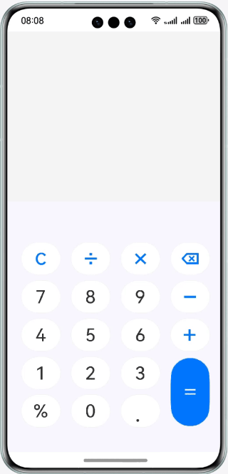

# 实现简易计算器

### 简介

基于基础组件、容器组件，实现一个支持加减乘除混合运算的计算器，并新增根号运算和三角函数运算还有上一步过程的记录。效果如图所示：

一、根号运算功能
 
新增开平方计算功能，支持对非负数字进行快速开根号运算。功能适配日常数学计算、数理公式求解等基础场景，运算逻辑精准，输入合法数值后可即时输出精准开方结果，弥补了原版计算器仅支持四则运算的功能短板，完善了基础数学运算体系，让简单根式计算无需借助其他工具，实现一站式快速运算。
 
二、三角函数运算功能
 
本次新增常用三角函数计算功能，包含正弦、余弦、正切核心运算，适配初高中基础数学、工程简易测算等场景。功能适配常规计算使用习惯，可直接输入数值完成对应三角函数值的快速求解，运算结果精准、响应迅速。新增的三角函数功能，让计算器从基础的算术计算工具，升级为支持基础几何、三角函数运算的多功能数理计算工具，有效提升了项目的实用性与功能性。
 
本次功能更新整体保留了简易计算器简洁、轻便、操作简单的核心特点，在不改变原有操作逻辑的前提下，丰富了运算类型，适配更多日常学习、生活中的基础数理计算场景，让小型简易计算器的功能性更加完善。
### 相关概念

- ForEach组件：ForEach基于数组类型数据执行循环渲染。
- TextInput组件：单行文本输入框组件。
- Image组件：Image为图片组件，常用于在应用中显示图片。Image支持加载string、PixelMap和Resource类型的数据源，支持png、jpg、bmp、svg和gif类型的图片格式。

### 相关权限

不涉及

### 使用说明

1. 在键盘输入区域输入表达式。
2. 表达式输入框实时显示键盘输入区域输入的表达式。
3. 结果输出框实时显示表达式的计算结果。

### 约束与限制

1. 本示例仅支持标准系统上运行，支持设备：华为手机。
2. HarmonyOS系统：HarmonyOS 5.0.5 Release及以上。
3. DevEco Studio版本：DevEco Studio 6.0.2 Release及以上。
4. HarmonyOS SDK版本：HarmonyOS 6.0.2 Release SDK及以上。
